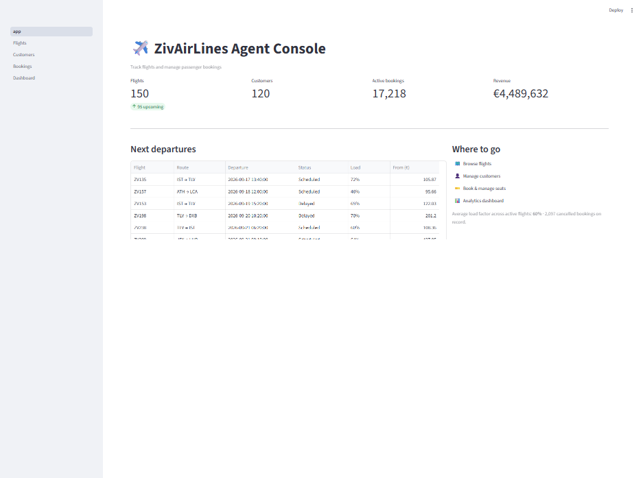
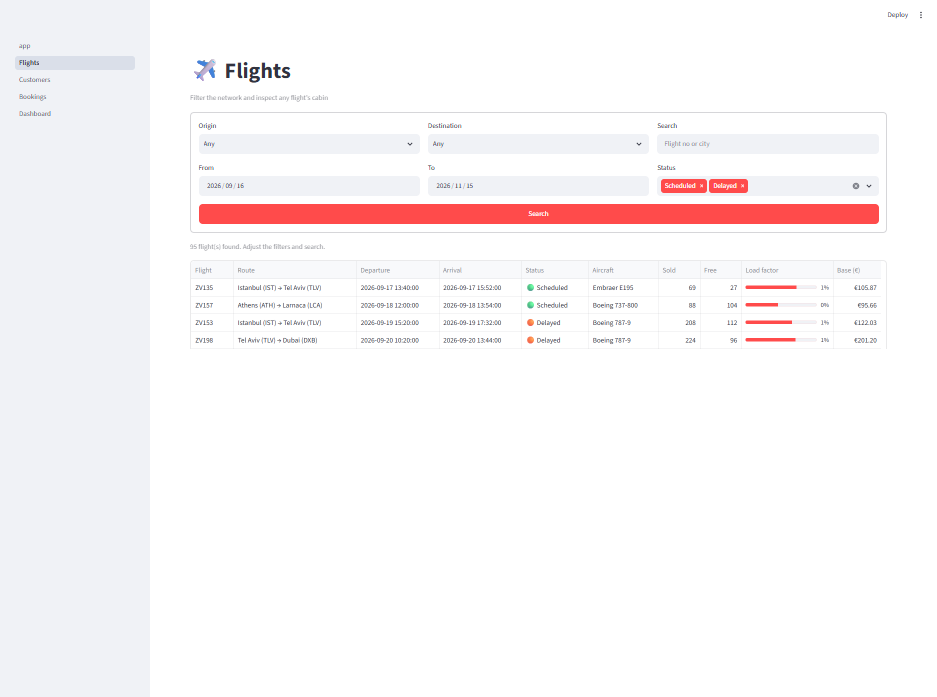
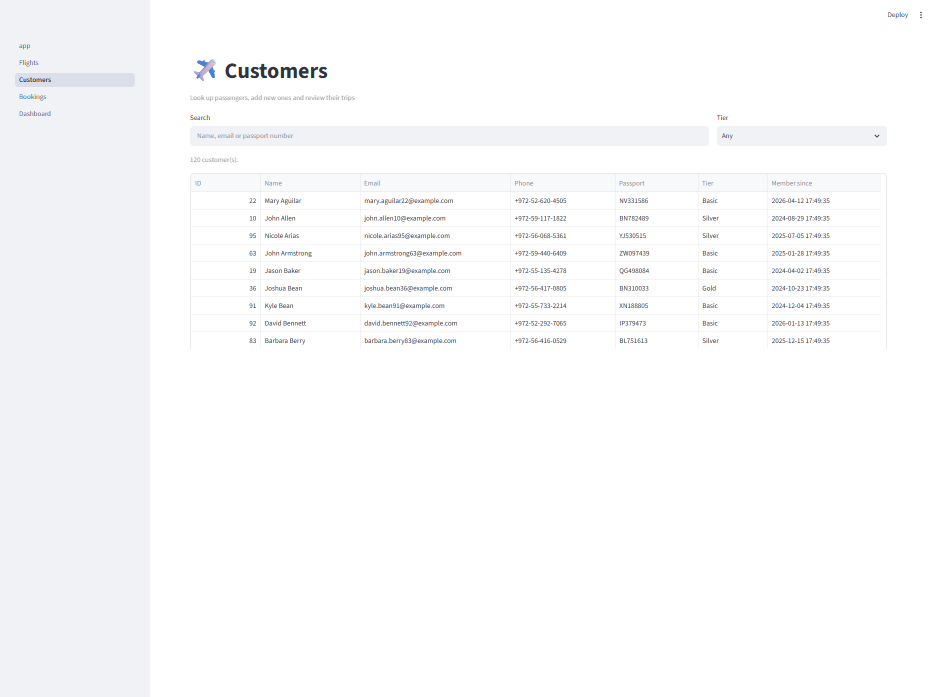
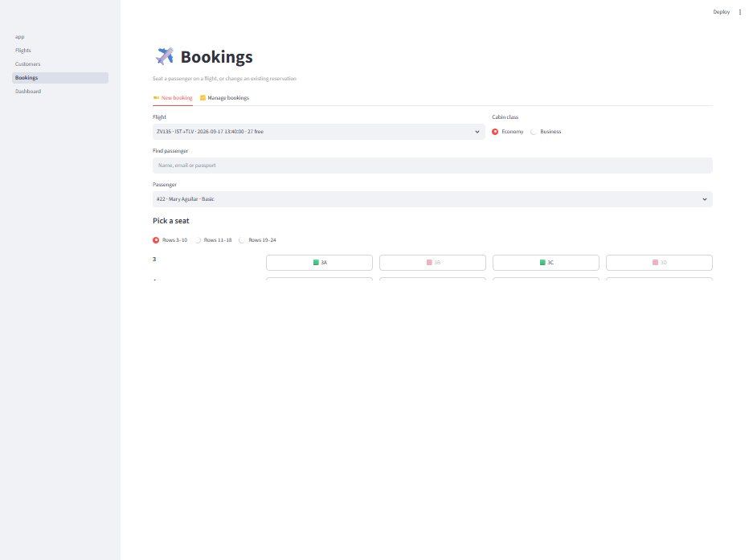
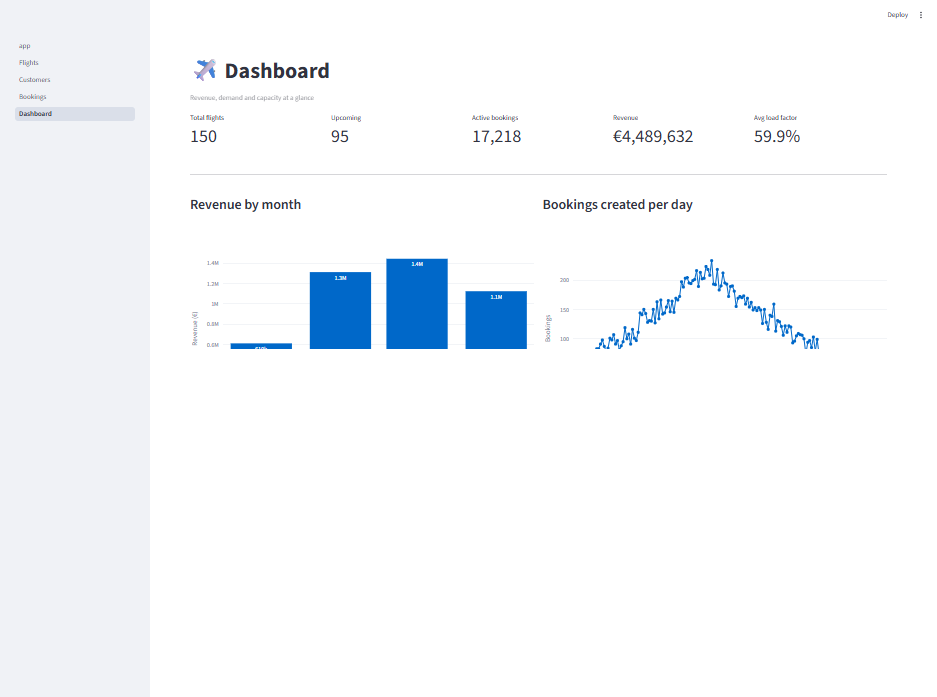
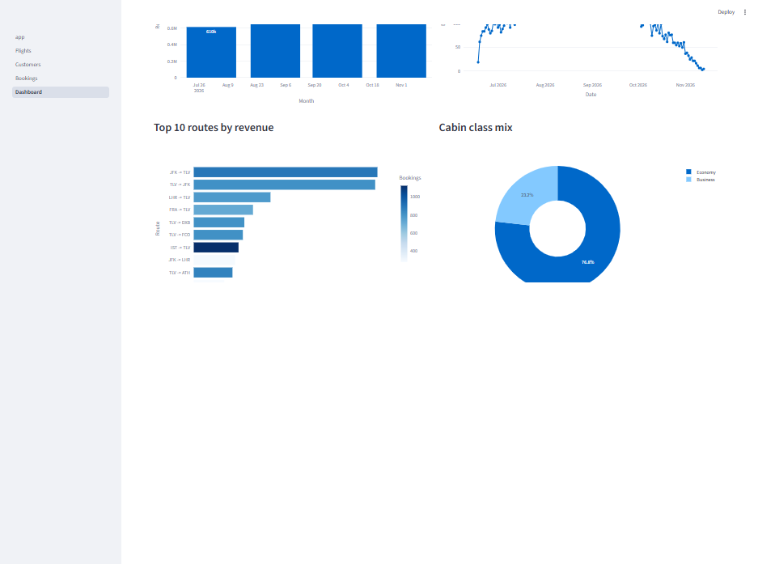
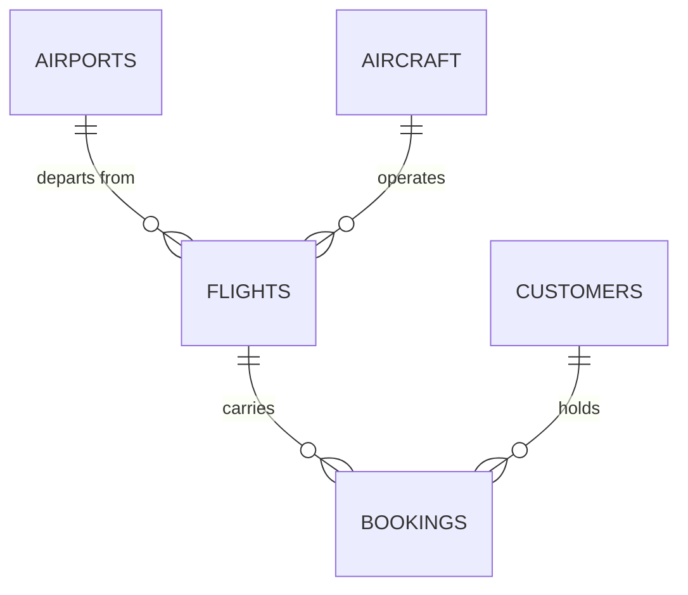

# ✈️ ZivAirLines — Travel Agent Console

A demo airline management system: a travel agent tracks the flight network and manages
passenger reservations end to end. Built with **Streamlit** on top of a **SQLite** database
filled with deterministic synthetic data.

<p align="center">
  
</p>

---

## Features

- **Flight tracking** — filter by origin, destination, date range, status or free text, with a
  live load-factor bar per flight
- **Cabin occupancy map** — every seat on the aircraft shown free 🟩 or taken 🟥
- **Customer directory** — search, create, per-passenger booking history and lifetime value
- **Visual seat booking** — pick flight → passenger → cabin → seat, with a price preview
  before anything is written
- **Reservation management** — check-in and cancellation by booking reference; cancelling
  releases the seat immediately
- **Dynamic pricing** — cabin multiplier × loyalty-tier discount
- **Analytics dashboard** — revenue, demand curve, top routes, cabin mix, load-factor spread

---

## Quickstart

```powershell
python -m venv .venv
.\.venv\Scripts\python.exe -m pip install -r requirements.txt

.\.venv\Scripts\python.exe -m src.seed          # builds data/zivair.db
.\.venv\Scripts\python.exe -m streamlit run app.py
```

Open <http://localhost:8501>. Use `python -m src.seed --force` to rebuild the database from
scratch.

---

## Screenshots

### Flights — search the network and inspect any cabin



### Customers — directory, history and lifetime value



### Bookings — visual seat picker with live pricing



### Dashboard — commercial analytics





---

## Data model



| Table | Rows (seeded) | Notes |
| --- | --- | --- |
| `airports` | 12 | Real airports with coordinates |
| `aircraft` | 4 | A320neo, 737-800, 787-9, E195 |
| `flights` | 150 | Hub-and-spoke from TLV, −30 to +60 days |
| `customers` | 120 | Loyalty tiers Basic / Silver / Gold |
| `bookings` | ~19,300 | Confirmed / CheckedIn / Cancelled |

**The constraint that matters:**

```sql
CREATE UNIQUE INDEX ux_bookings_seat
    ON bookings (flight_id, seat) WHERE status <> 'Cancelled';
```

A partial unique index makes double-booking a seat impossible at the database level, while
cancelled bookings keep their row for the audit trail and instantly free the seat.

**Pricing:** `price = base_price × cabin_multiplier × tier_discount`
(Economy 1.0 / Business 2.6 · Basic 1.0 / Silver 0.95 / Gold 0.90).
`base_price` is derived from the great-circle distance of the route.

---

## Project layout

```
├─ app.py                  # home page + KPIs
├─ pages/
│  ├─ 1_Flights.py
│  ├─ 2_Customers.py
│  ├─ 3_Bookings.py
│  └─ 4_Dashboard.py
├─ src/
│  ├─ db.py                # connection, PRAGMA foreign_keys, full DDL
│  ├─ seed.py              # deterministic synthetic data generator
│  ├─ queries.py           # every SQL statement, all parameterized
│  ├─ helpers.py           # seat labels, pricing, booking references
│  └─ ui.py                # shared Streamlit glue
├─ docs/screenshots/
└─ data/zivair.db          # generated, git-ignored
```

Design rules: no SQL outside `queries.py`, every statement parameterized, and conflicts
resolved by the database rather than by read-then-write checks.

---

## Synthetic data

`src/seed.py` seeds `random` and `Faker` with **42**, so every clone produces the exact same
database — the screenshots above stay accurate. Flight durations and prices are computed from
real great-circle distances, and booking status follows the flight's departure time (past
flights are mostly checked in, future ones mostly confirmed).

---

## Documentation

Full design notes — architecture, data model, decision log and roadmap — live in an Obsidian
vault alongside this repository.

## Tech stack

Python · Streamlit · SQLite (stdlib `sqlite3`) · pandas · Plotly · Faker

## License

MIT — demo project, use it freely.
